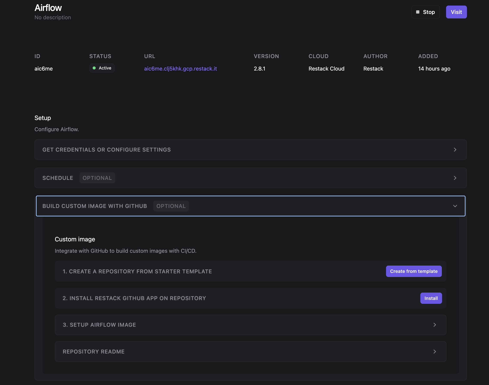
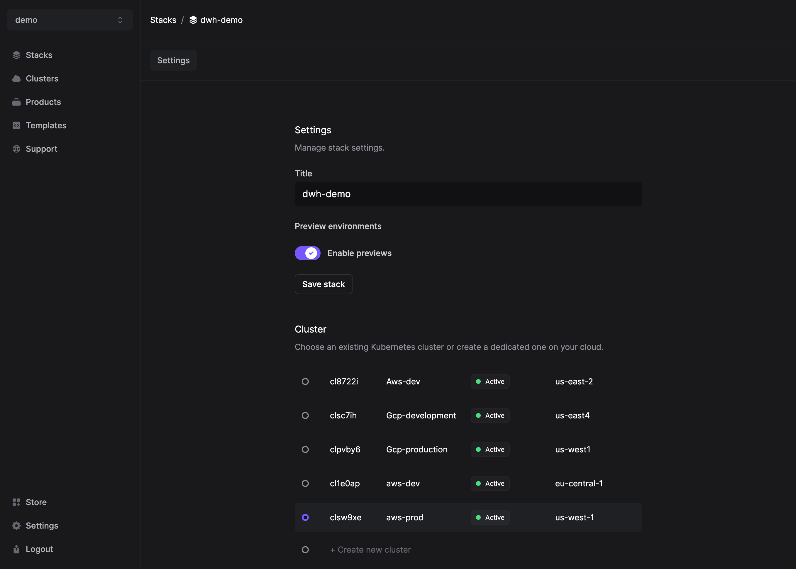

# Airflow Restack Starter Repository

Welcome to the Airflow Restack Starter Repository! This repository serves as a  template for building your own Apache Airflow using Restack.

## About Airflow

Apache Airflow is an open-source tool for orchestrating complex computational workflows and data processing pipelines. It allows you to programmatically author, schedule, and monitor workflows in a scalable and maintainable manner.

## About Restack

Restack is the platform to run your favorite open source products. By leveraging Restack, you can easily build, deploy, and manage your Airflow instances in a scalable Kubernetes-based infrastructure.

## Features

This starter repository includes:

- Pre-configured Dockerfile for building an Airflow image tailored for Restack deployments.
- Example DAGs to get you started with workflow orchestration.
- DBT preinstalled and a dbt_project folder for you to add your dbt scripts.
- DuckDB adaptor for data transformation.
- A Poetry project to manage python dependencies.
- A docker-compose.yaml file for developing in local environment. 

## Getting Started

[Deploy Airflow on Restack](https://console.restack.io/onboarding/store/70dab245-76ef-4e00-b24c-7391e1a3ddd7)

Go to your Airflow application page and setup `Build custom image with GitHub` 

Once you are set up, everytime make a new commit to the branch you define in the previous step, Restack will automatically build and provision your image on the same URL endpoint. 

## Dags, Plugins and Config
You can use the existing /dags, /plugins and /config files to add your custom files.

## Python environment
The project has Poetry integration so you can add your python dependencies. Just run the following command:

## Generating a preview environment

To generate preview environments before to merge into your production environment follow these steps:
1. Create a Stack and enable CICD previews: 
2. Once you open a pull request a preview environment will be generated.
3. Once your pull request is merged your initial Airflow application will be updated with the new image.


```bash
poetry install
```

Once installed you can run some commands like:

```bash
poetry run python3 dags/test_dag.py
```

The previous command tests a DAG to detect some warnings or syntax errors for example. In case you want to add a new library please follow the [official documentation](https://python-poetry.org/docs/cli/#add) of Poetry.

## Pre-commit
Pre-commit was installed in this repository for giving a standarized way for developing. If you want to install this tool just run the following:

```bash
poetry run pre-commit install
```

so now you can add your changes and run the checks defined in `.pre-commit-config.yaml` before performing the commit in order to follow best practices for coding.

## Restack Product Version
Restack will expose a build arg for the Dockerfile called: RESTACK_PRODUCT_VERSION. This will contain the image tag of the product. As seen on this starter repo's Dockerfile you can use it as such:
```dockerfile
ARG RESTACK_PRODUCT_VERSION=2.8.0
FROM apache/airflow:${RESTACK_PRODUCT_VERSION}
```

This way once a new version of Airflow is released and you upgrade your app via Restack console,  your ci/cd builds will use the latest version to build your airflow custom image.


